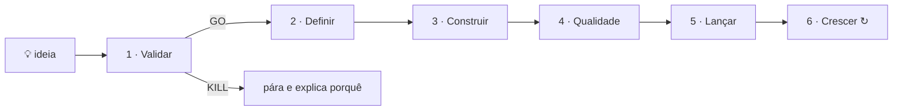

# 🏭 Fábrica de Produtos

Envias uma ideia — uma frase chega. A fábrica valida-a, define o produto, cria a marca,
escreve e testa o código, prepara a parte legal e o marketing, e deixa-o **pronto a publicar
e a faturar**, com o mínimo de intervenção tua.

> **Começa aqui:** [configuração única](SETUP.md) — o primeiro passo é decidir se o
> repositório fica privado. Depois disso, basta enviar ideias: commits, pull requests e merges
> ficam com a fábrica.

## Enviar ideias

| Onde | Como |
|---|---|
| **App Claude, claude.ai/code ou terminal** | na sessão **🏭 Fábrica · Capataz** (ou em qualquer sessão nova no repositório **CC_001**) escreve `/ideia uma app que…` — ou cola várias ideias de uma vez |
| **GitHub (telemóvel ou web)** | *Issues* → *New issue* → **💡 Nova ideia** (requer o passo 6 do [SETUP](SETUP.md)) |
| **Caixa de ideias** | acrescenta uma linha `- …` a [`ideas/INBOX.md`](ideas/INBOX.md); o piloto automático apanha-a |

Opções: `--rapido` (validar e lançar o essencial) · `--fundo` (qualidade máxima em cada fase) ·
`--so-validar` (só pesquisa e veredicto, sem construir).

Várias ideias de uma vez? A fábrica faz a triagem (ICE), começa pelas melhores — cada uma na
sua própria sessão, em paralelo — e põe as outras em fila.

## O que acontece a seguir

| Fase | O que a fábrica faz | Sai daqui |
|---|---|---|
| **1 · Validar** | Pesquisa em 4 frentes (mercado, concorrentes e preços, público e canais, riscos), com fontes. Um "advogado do diabo" tenta matar a ideia. Score em 9 critérios. | **GO / PIVOT / KILL**. Ideias fracas param aqui, antes de gastar mais. |
| **2 · Definir** | PRD do MVP, modelo de negócio, preços e projeções; nome com domínio verificado e verificação de marcas; logótipo e identidade; arquitetura, custos e riscos. | Plano completo e decisões registadas. |
| **3 · Construir** | Código a partir de um starter testado, fatia a fatia, com testes; em paralelo, pacote legal (RGPD, cookies, direito do consumidor PT/UE, AI Act) e plano de marketing com todos os textos. | Produto funcional em PT e EN. |
| **4 · Qualidade** | Testes ponta a ponta, acessibilidade, performance, SEO e auditoria de segurança, com ciclos de correção até passar. | Gate **G2: pronto a lançar**. |
| **5 · Lançar** | Deploy de preview, domínio e DNS, analytics, monitorização, pagamentos em modo de teste, kit de lançamento (Product Hunt, Hacker News, Reddit, diretórios, emails). | Pronto a publicar; só falta o teu "sim". |
| **6 · Crescer** | Ciclo semanal: métricas, experiências, conteúdo SEO, conversão, feedback de clientes. | Mais utilizadores e receita. |

Cada produto tem a sua **sessão Claude** (`🏭 Nome`), o seu **branch** e o seu **PR em
rascunho** — a "casa" do produto, com o estado sempre atualizado. Todos os ficheiros ficam em
`products/<produto>/`.

## O que te vai ser pedido

Só o que **apenas tu** podes fazer: pagar (domínios, contas), criar contas ou a tua identidade
fiscal, aprovar publicações em teu nome e fornecer credenciais. Fica tudo junto em
`products/<produto>/HUMAN_TASKS.md`, preparado para minutos — ligações diretas, valores para
copiar, o que cada tarefa desbloqueia. Enquanto não as fazes, a fábrica continua com o resto.
Commits, pull requests e merges não são contigo: a fábrica trata deles (`merges` em
[`FOUNDER.md`](FOUNDER.md)).

## Acompanhar e dar feedback

- **PR de cada produto:** comenta para pedir alterações ("muda o nome", "baixa o preço",
  "acrescenta login com Google"). A sessão do produto acorda, faz e responde.
- **`/portfolio`:** todos os produtos, o que precisa de ti e o que está na fila.
- **Issue "📊 Portfólio da Fábrica":** resumo atualizado pelo piloto automático (fixa-a uma
  vez no GitHub com *Pin issue* para a teres sempre à mão).

## Comandos

| Comando | Para quê |
|---|---|
| `/ideia <texto>` | nova(s) ideia(s) → produto(s) |
| `/continuar [produto]` | retomar ou avançar; `--fase legal` repete uma fase; `--forcar` ignora um KILL |
| `/portfolio` | estado de tudo e o que precisa de ti |
| `/lancar <produto>` | pôr em produção |
| `/crescer <produto>` | ciclo de crescimento |
| `/fabrica` | capataz: processa as ideias novas e põe tudo a avançar |
| `/autopiloto ligar · desligar · estado · agora` | rotina diária automática (escreve-o na sessão "🏭 Fábrica · Capataz") |
| `/spinout <produto>` | mover um produto para um repositório próprio (para vender, por exemplo) |
| `/melhorar` | a fábrica aprende: junta as lições de todos os produtos e melhora-se (corre sozinho todas as semanas) |
| `/radar` | o que mudou lá fora: versões, preços, leis, tendências e ideias sugeridas (corre sozinho todos os meses) |
| `/ideia sugestão <n>` | começar uma das ideias sugeridas pelo radar |

## Aprende sozinha

A fábrica fica melhor a cada produto, sem precisares de fazer nada:

- **Em cada fase**, os agentes registam o que correu mal (e como se corrige), o que correu bem
  e deve repetir-se, métodos que funcionam e tendências que encontraram; o pipeline grava também
  métricas (rondas de QA, defeitos, fatias de código, dias por fase, pontuações de qualidade).
  Cada correção tua num PR também fica registada como lição, e as tuas preferências passam a
  ser seguidas.
- **Todas as semanas — `/melhorar`:** junta as lições e métricas de todos os produtos, corrige a
  causa dos erros que se repetem (playbooks, modelos, checklists, starter), transforma o que
  resultou em padrão por defeito, testa mudanças como experiências medidas e atualiza um placar
  que mostra se a fábrica está mesmo a melhorar.
- **Todos os meses — `/radar`:** volta a verificar versões, preços, regras das plataformas e
  leis de que a fábrica depende; regista tendências de mercado, canais e tecnologia com fontes;
  e sugere até 3 ideias novas (nunca começam sem ti).
- **Com limites, verificados por código:** aplica sozinha o que aprende em lições,
  conhecimento e métodos de pesquisa, estratégia, marca e construção, com testes e uma revisão
  adversarial independente do commit exato; o que toca em gates de qualidade, arquitetura,
  legal, marketing, lançamento, pagamentos, starters, regras, permissões ou automação fica num
  PR à tua espera (no máximo 3 de cada vez). Controlas tudo em [`FOUNDER.md`](FOUNDER.md)
  (`self_improvement`, `radar`, `radar_ideas_per_month`).

O que a fábrica sabe está em [`factory/knowledge/`](factory/knowledge) e
[`factory/LEARNINGS.md`](factory/LEARNINGS.md).

## Como funciona por dentro

- **[`CLAUDE.md`](CLAUDE.md)** — regras para todos os agentes: autonomia, qualidade,
  segurança, língua, gravar progresso constantemente.
- **[`factory/PIPELINE.md`](factory/PIPELINE.md)** — o processo: fases, gates e *Definition of Done*.
- **13 agentes especialistas** ([`.claude/agents/`](.claude/agents)): pesquisa de mercado,
  advogado do diabo, estratégia, marca, arquitetura, engenharia web e mobile, QA, segurança,
  legal, marketing, DevOps e um "escriturário" que grava o progresso. Correm em Sonnet com
  esforço alto ou máximo; o trabalho mecânico corre em Haiku.
- **Pipeline multi-agente** ([`.claude/workflows/idea-to-product.js`](.claude/workflows/idea-to-product.js)):
  fases em paralelo quando possível, gates, ciclo QA → correção, e commit + push após cada
  fase e durante as fases longas (se uma sessão cair, perde-se no máximo o trabalho desde a
  última gravação, e outra sessão retoma daí).
- **Conhecimento** ([`factory/`](factory)): playbooks por fase, receitas de stack por tipo de
  produto (web, SaaS, IA, API, mobile, extensões, e-commerce, conteúdo, bots), templates e
  checklists de qualidade.
- **Starter web testado** ([`factory/starters/web`](factory/starters/web)): landing, preços,
  páginas legais PT/EN, consentimento de cookies, lista de espera, Stripe ou *Merchant of
  Record*, SEO e testes.
- **Estado** ([`factory/scripts/factory.py`](factory/scripts/factory.py)): `product.json` de
  cada produto, validação e portfólio em todos os branches.
- **CI/CD**: testes da fábrica e de cada produto em cada PR; pré-visualização na Vercel ao
  fazer merge (opcional); produção só com `/lancar`.
- **Melhoria contínua** ([`factory/knowledge/`](factory/knowledge)): lições por fase,
  padrões comprovados, radar de factos com data de revalidação, tendências, experiências e
  placar — ver "Aprende sozinha" acima.

## Custos

- **Claude:** usa a tua subscrição. Uma ideia levada até ao fim põe várias dezenas de agentes
  a trabalhar; a validação é a parte barata e trava cedo as ideias fracas. Controla com
  `max_parallel_products` e `default_depth` em [`FOUNDER.md`](FOUNDER.md), ou com `--rapido`.
- **Infraestrutura:** por defeito, serviços com plano gratuito (Vercel, Supabase, Cloudflare,
  Resend…) até haver tração, com teto mensal por produto em `FOUNDER.md`.

## Limites, com franqueza

- Os documentos legais são minutas profissionais, não aconselhamento jurídico. Para saúde,
  finanças, menores, dados sensíveis ou faturação relevante, fica uma tarefa de revisão por
  advogado.
- Tudo o que é público e em teu nome (redes sociais, emails a pessoas reais, lojas de apps,
  pagamentos reais) espera pela tua aprovação — mas chega pronto a copiar.
- Os números de mercado são estimativas com as fontes indicadas, não garantias.
