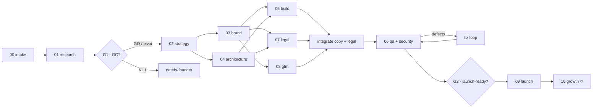

# The Factory Pipeline

Idea → **Validar** → **Definir** → **Construir** → **Lançar** → **Crescer**.
Eleven phases, explicit gates, parallel where possible, resumable at any point.



## Phases

| # | id | Stage | Owner agent(s) | Required outputs (inside `products/<slug>/`) |
|---|---|---|---|---|
| 00 | `intake` | Validar | orchestrator | `product.json`, `README.md`, `HUMAN_TASKS.md`, `docs/00-brief.md` |
| 01 | `research` | Validar | `market-researcher` ×4 tracks, `devils-advocate` | `docs/research/{market,competitors,audience,risks}.md`, `docs/01-research.md` |
| 02 | `strategy` | Definir | `product-strategist` (+ `devils-advocate`) | `docs/02-product.md` (PRD), `docs/02-business.md` |
| 03 | `brand` | Definir | `brand-designer` | `docs/03-brand.md`, `brand/logo.svg`, `brand/tokens.json` |
| 04 | `architecture` | Definir | `solution-architect` | `docs/04-architecture.md`, `docs/adr/0001-*.md` |
| 05 | `build` | Construir | `fullstack-engineer` or `mobile-engineer` | `<app_dir>/` (code + tests), `docs/05-build.md` |
| 06 | `qa` | Construir | `qa-engineer`, `security-auditor` (+ fix loop) | `docs/06-qa-report.md` |
| 07 | `legal` | Construir | `legal-counsel` | public legal pages in each locale, `legal/` (internal records), `docs/07-compliance.md` |
| 08 | `gtm` | Lançar | `growth-marketer` | `docs/08-gtm.md`, `marketing/` |
| 09 | `launch` | Lançar | `devops-engineer` (+ `growth-marketer`) | `docs/09-launch.md`, deployments, updated `HUMAN_TASKS.md` |
| 10 | `growth` | Crescer | `growth-marketer`, `product-strategist` | `docs/10-growth.md` (living log) |

Each phase's step-by-step method is in `factory/playbooks/NN-<id>.md`; its document template
in `factory/templates/`; its quality gate in the Definition of Done below and in
`factory/checklists/`.

### Execution order and parallelism

1. `intake` → `research` (4 tracks in parallel → synthesis → critic) → **G1**.
2. `strategy` (deep: 3 competing proposals judged, best one synthesized).
3. `brand` ∥ `architecture`.
4. `build` ∥ `legal` ∥ `gtm` — they write disjoint paths: build owns `<app_dir>/` code;
   legal owns `legal/` and drafts public pages in `legal/public/`; gtm owns `marketing/`
   and drafts landing copy in `marketing/copy/`.
5. **Integration** (`fullstack-engineer`): wire the legal pages and final landing copy
   into the app.
6. `qa` + security audit → fix loop until the gate passes (max rounds by depth) → **G2**.
7. `launch`: preview deploy, production runbook, founder tasks batched; production go-live
   when the founder approves (or automatically if `FOUNDER.md` sets `go_live: auto`).
8. `growth`: recurring cycles (`/crescer`, weekly via the autopilot).

Only the orchestrator (or a dedicated checkpoint step) commits; parallel agents never run
`git commit` at the same time.

## Gates

### G1 — Research scorecard (`docs/01-research.md`)

Score each criterion 1–5 with evidence; the weighted average is the score.

| Criterion | Weight | 5 means |
|---|---|---|
| Problem pain & frequency | 15% | Painful, frequent, people already pay or hack workarounds |
| Demand evidence | 15% | Search volume, active communities, competitors with traction |
| Willingness to pay / monetization clarity | 15% | Clear payer, comparable prices, short path to revenue |
| Distribution | 15% | Cheap reachable channels (SEO, communities, marketplaces, stores) |
| Competitive gap | 10% | A sharp wedge: underserved segment, 10× better on one axis, or price |
| Build feasibility | 10% | MVP buildable by the factory in days; no heavy ops, hardware or licences |
| Time to first revenue | 10% | Revenue possible within weeks of launch |
| Risk (inverted) | 5% | Low legal/regulatory/platform-dependency risk |
| Founder fit | 5% | Matches `FOUNDER.md` interests, skills, audience or assets |

- **GO** — score ≥ 3.5 and no knockout → continue.
- **PIVOT** — 2.8 ≤ score < 3.5 → pick the strongest variant that keeps the founder's intent,
  re-score it; continue if it reaches 3.5 (record the pivot prominently in the PR).
- **KILL** — score < 2.8, or a knockout (illegal, needs a licence the founder cannot get,
  violates platform rules, clear ethical harm) → set status `needs-founder`, explain in one
  paragraph, propose 3 alternative angles, and stop this product. Other products continue.
- The founder can override any verdict (`/continuar <slug> --forcar`).

**Adaptive depth:** score ≥ 4.0 → run the rest at `deep`; 3.5–3.99 → `standard`; unless the
founder chose a depth explicitly.

### G2 — Launch-ready (end of `qa`)

All of: every check in `factory/checklists/launch-readiness.md` marked pass or N/A; no open P0/P1
defects; legal pages live in every locale; analytics and error monitoring wired (enabled by
env vars); payments work end-to-end in test mode (or the monetization path is configured);
`docs/09-launch.md` runbook drafted.

## Definition of Done per phase

| Phase | Done when |
|---|---|
| intake | Brief states problem, audience, value proposition, product type, monetization hypothesis, assumptions and the founder's raw idea verbatim; `product.json` valid. |
| research | Four track notes with sourced evidence (≥ 5 competitors with prices and URLs); synthesis with scorecard, verdict, top risks and the wedge; critic's objections answered. |
| strategy | PRD with personas, JTBD, MVP scope (must/should/won't), user stories with acceptance criteria, success metrics; business model with pricing tiers, unit economics, cost model, 12-month projection, break-even. MVP fits the build budget for the depth. |
| brand | Name chosen with domain availability checked (tool or registrar evidence) and a trademark sanity check; tagline, voice, palette (WCAG AA contrast), typography, `logo.svg`, `tokens.json`. |
| architecture | Stack chosen from `factory/stacks/` (or a justified deviation in an ADR); data model; integrations; hosting; monthly cost estimate at 0 / 100 / 10k users; threat model; observability; ADRs for every significant choice. |
| build | All PRD "must" stories implemented with tests; lint, typecheck, unit, e2e and production build pass; `docs/05-build.md` explains how to run, env vars, and story-by-story status. |
| qa | `docs/06-qa-report.md` with test results, accessibility (axe) and performance results, security audit findings and their fixes; zero open P0/P1. |
| legal | Privacy policy, terms, cookie policy (and withdrawal/refund policy when selling to consumers) in every locale, integrated in the product; `docs/07-compliance.md` checklist (RGPD/GDPR, ePrivacy, EU and Portuguese consumer law, accessibility, AI Act, DSA, tax) with open items turned into founder tasks. |
| gtm | Positioning, ICP, messaging, channel plan with budgets, launch timeline, SEO keyword plan and article briefs, 30-day content calendar, email sequences, launch kits (Product Hunt, Show HN, Reddit, directories), KPIs; final landing copy in every locale. |
| launch | Preview deployed (when tokens exist) and smoke-tested; production runbook; domain + DNS plan; monitoring and analytics verified; store submissions prepared (mobile/extensions); founder tasks batched with time estimates. |
| growth | Each cycle logs metrics, insights, shipped experiments and next bets in `docs/10-growth.md`. |

## Product folder

```
products/<slug>/
├── product.json          machine state (schema: factory/schemas/product.schema.json)
├── README.md             overview, links, decision log, status block (factory.py render-status)
├── HUMAN_TASKS.md        founder-only tasks, batched (format: factory/templates/HUMAN_TASKS.md)
├── docs/
│   ├── 00-brief.md
│   ├── research/         market.md · competitors.md · audience.md · risks.md (sourced notes)
│   ├── 01-research.md    synthesis, scorecard, verdict
│   ├── strategy/         competing proposals (deep depth only)
│   ├── 02-product.md     PRD
│   ├── 02-business.md    business model, pricing, unit economics, projections
│   ├── 03-brand.md
│   ├── 04-architecture.md
│   ├── adr/              0001-<decision>.md …
│   ├── 05-build.md
│   ├── 06-qa-report.md
│   ├── 06-security.md    security audit findings and fixes
│   ├── 07-compliance.md
│   ├── 08-gtm.md
│   ├── 09-launch.md
│   └── 10-growth.md
├── brand/                logo.svg · logo-mark.svg · tokens.json · assets
├── legal/                internal records (RoPA, subprocessors, DPIA, AI-Act note, trademark check)
│   └── public/           drafts of public legal pages before integration (<doc>.<locale>.md)
├── marketing/            copy/ · social/ · email/ · launch/ · seo/ · ads/ · press/
└── app/                  the product code (default app_dir; see product.json stack.app_dir)
```

Products with several deliverables use `app/` for the main one and sibling folders named by
role (`api/`, `mobile/`, `extension/`); list them in `product.json` `stack.components`.

Locale codes in file and folder names are the web starter's: `en` and `pt` (content in
European Portuguese, rendered as `pt-PT`), e.g. `legal/public/privacy.pt.md`,
`marketing/copy/landing.en.md`, `app/src/content/legal/pt/terms.md`.

## `product.json`

Schema: `factory/schemas/product.schema.json`. Key fields:

| Field | Values / meaning |
|---|---|
| `slug` | kebab-case, unique, matches the folder name |
| `name`, `one_liner` | working name until the brand phase sets the final one |
| `idea` | the founder's raw idea, verbatim |
| `type` | `web-static` · `web-saas` · `ai-app` · `api` · `mobile` · `extension` · `ecommerce` · `content` · `bot` · `desktop` · `other` |
| `status` | `active` · `needs-founder` · `paused` · `killed` · `launched` |
| `phase` | id of the current phase (the one in progress or next to run) |
| `phases.<id>.status` | `pending` · `in_progress` · `done` · `skipped` · `blocked` |
| `depth` | `lean` · `standard` · `deep` |
| `decision` | `{verdict: go|pivot|kill, score, rationale}` from G1 |
| `stack` | `{recipe, app_dir, components, hosting, payments, database, auth}` |
| `links` | `{branch, pr, issue, session, preview, production, domain, repo}` |

## Autonomy and founder tasks

Decide everything reversible. A founder task is created only for the founder-only list in
`CLAUDE.md` (money, accounts/identity, contracts, irreversible public actions, secrets).
Each task: ID (`HT-01` …), why, exact steps with links, values to paste, time estimate, cost,
what it unblocks, and how to signal completion. Group by 🔴 blocks launch / 🟡 before launch /
🟢 later. While a task is open, keep working on everything that does not depend on it, using
placeholders, test modes and feature flags.

## Depth levels

| | lean | standard | deep |
|---|---|---|---|
| Research | 1 agent, all tracks | 4 tracks + synthesis + critic | + second critic round, more competitors and channels |
| Strategy | single draft | draft + critic | 3 competing proposals, judged, synthesized |
| Brand | 1 name shortlist | 10–15 names, domain checks | name tournament, 2 logo directions |
| Build | must-haves only | must + key should-haves | + polish, onboarding, admin/ops tooling |
| QA rounds (max) | 1 | 3 | 5, loop until two clean rounds |
| GTM | plan + landing copy | full plan + assets | + 10 SEO articles drafted, 30 social posts, ad sets |

## State, checkpoints and resuming

After every phase:

1. `python3 factory/scripts/factory.py set-phase <slug> <phase> done --summary "…"` (moves
   `phase` to the next pending one).
2. `python3 factory/scripts/factory.py validate <slug>` — must pass.
3. Refresh the README status block and the PR description
   (`factory.py render-status <slug>` output between the
   `<!-- factory:status:start -->` / `<!-- factory:status:end -->` markers).
4. Commit `<slug>: <phase> — <summary>` and push.

To resume, read `product.json`, `HUMAN_TASKS.md`, the last commits and the PR comments, then
run from `phase`. A phase marked `in_progress` with partial outputs is continued, not
restarted.

## Launch-ready means

A stranger can visit the product, understand it in 5 seconds, sign up or join the waitlist,
pay (or be ready to the moment payments go live), read compliant legal pages in their
language, and the founder can see analytics and errors. Everything that still needs the
founder is in `HUMAN_TASKS.md`, each item doable in minutes.
