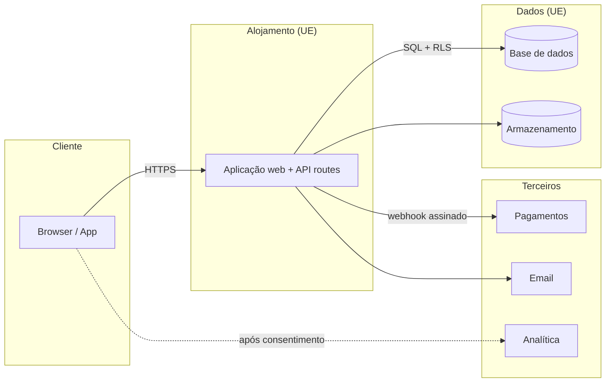
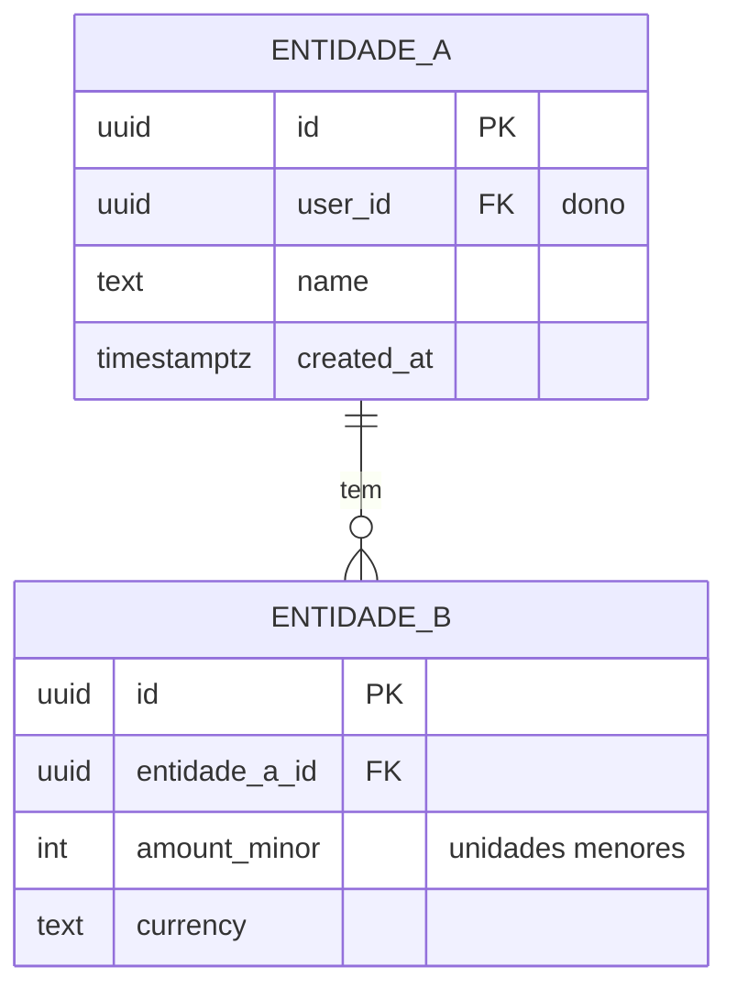

# Arquitetura — {{name}}

<!--
Template for docs/04-architecture.md. Language: pt-PT (identifiers, paths and commands stay in English). Procedure: factory/playbooks/04-architecture.md (Steps 1-17). Read by build, legal, qa and launch agents, so be concrete and checkable. Every table row cites its PRD story id or a source URL + access date; every price or limit is marked "verificar à data de execução". Never write secrets: variable NAMES only. Mermaid diagrams must render (no hexagon double-brace syntax). Depth: lean = sections 1,3,4,5,6,8,10,11 (short) + 2 ADRs; standard = all; deep = all + alternatives scoring and sensitivity. Delete guidance comments and every double-brace placeholder when done.
-->

> **Produto:** `{{slug}}` · **Versão:** {{0.1}} · **Data:** {{AAAA-MM-DD}} · **Profundidade:** {{lean/standard/deep}} · **Receita (`stack.recipe`):** `{{web-saas}}` · **Depende de:** `02-product.md`, `02-business.md` · **ADRs:** `docs/adr/`

## 1. Resumo e decisões-chave

<!-- 6-10 lines for the founder and the builder: the stack in one sentence, why, what it costs at 100 users, the top 3 risks, what needs the founder. -->

- **Stack:** {{receita + serviços principais}} — porquê: {{1 frase}}
- **Custo mensal:** {{€}} a 0 · {{€}} a 100 utilizadores · {{€}} a 10 000 (secção 10)
- **Principais riscos técnicos:** {{1}}; {{2}}; {{3}}
- **Precisa do fundador (contas/chaves):** {{HT-xx, HT-yy}}; até lá a app corre em modo de teste
- **Desvios à receita:** {{nenhum / ver ADR NNNN}}

## 2. Condicionantes (drivers)

| Driver | Valor | Fonte (história/secção) |
|---|---|---|
| Tipo e plataformas | {{web-saas; web + PWA}} | `product.json` |
| Idiomas e mercados | {{en + pt-PT; UE; EUR}} | {{PRD §}} |
| Contas e papéis | {{utilizador, admin}} | {{US-xx}} |
| Dados pessoais | {{email, nome; sem categorias especiais}} | secção 14 |
| Dinheiro | {{subscrição via MoR; EUR}} | `02-business.md` |
| IA | {{nenhuma / funcionalidade X com Claude}} | {{US-xx}} |
| Escala a 12 meses | {{utilizadores, pedidos/dia, GB}} | `02-business.md` projeção |
| Disponibilidade e latência | {{99,5 %; p95 ≤ 300 ms; LCP ≤ 2,5 s}} | defeito da fábrica |
| Orçamento | {{≤ 50 €/mês antes de receitas; infra+IA ≤ 30 % da receita}} | `FOUNDER.md` |
| Sinalizadores de conformidade | {{menores/saúde/finanças: não}} | {{}} |

## 3. Stack escolhida

<!-- Recipe from factory/stacks/. Table per concern. If you deviate from the recipe default, list it under "Desvios" with the ADR number and the scored options. -->

Receita: `factory/stacks/{{recipe}}.md` · Componentes: {{app/, api/, mobile/, extension/}} · `app_dir`: `{{app}}`

| Preocupação | Escolha | Versão verificada (`npm view`, data) | Porquê | Limites do plano gratuito (fonte + data) |
|---|---|---|---|---|
| Framework | {{}} | {{}} | {{}} | — |
| Alojamento | {{}} | — | {{}} | {{}} |
| Base de dados | {{}} | — | {{}} | {{}} |
| Autenticação | {{}} | — | {{}} | {{}} |
| Pagamentos | {{}} | — | {{}} | {{}} |
| Email | {{}} | — | {{}} | {{}} |
| Analítica | {{}} | — | {{}} | {{}} |
| Erros | {{}} | — | {{}} | {{}} |
| IA (se aplicável) | {{}} | — | {{}} | {{}} |

**Desvios à receita:** {{nenhum | tabela: o quê · alternativa por omissão · opções pontuadas (cumpre história, custo a 10k, tempo, lock-in, residência UE, manutenção) · ADR}}

## 4. Diagrama

<!-- Replace with the real components (<= 15 nodes). Mark founder-provisioned services with 💳 in the node label. Add a second diagram for the checkout/auth sequence if needed. -->

## 5. Modelo de dados

### 5.1 Diagrama ER

### 5.2 Entidades

| Entidade | Atributos-chave | PII? | Dono (coluna) | Índices | História |
|---|---|---|---|---|---|
| {{}} | {{}} | {{sim/não}} | `user_id` | {{}} | {{US-xx}} |

### 5.3 Regras de acesso (RLS / autorização)

<!-- Every table has RLS enabled. "Public" must be justified. Policies use (select auth.uid()) = user_id. Non-database products: describe the local storage schema and say "sem dados em servidor". -->

| Tabela | select | insert | update | delete | Justificação |
|---|---|---|---|---|---|
| {{}} | dono | dono | dono | dono | {{}} |

Migrações: SQL com data em `supabase/migrations/` · Seed: `{{supabase/seed.sql / memory fixtures}}` · Exportar/apagar conta: {{endpoint e cascata}}

## 6. Superfície de API

| Método + caminho / ação | Finalidade | História | Auth | Entrada (zod) | Saída | Limite de pedidos | Idempotência |
|---|---|---|---|---|---|---|---|
| `POST /api/{{}}` | {{}} | {{US-xx}} | {{anónimo/utilizador/admin}} | `{{Schema}}` | {{}} | {{n/min}} | {{sim: Idempotency-Key}} |

Webhooks recebidos: {{origem · assinatura · tolerância de repetição · idempotência por id de evento}} · Convenções: erros `application/problem+json`, `/v1` se a API for pública, paginação por cursor.

## 7. Autenticação e autorização

- **Fornecedor e fluxos:** {{OTP/magic link, OAuth …}} · **Sessão:** {{cookie httpOnly, duração}} · **MFA:** {{decisão}} · **Recuperação:** {{}}
- **Papéis e permissões:**

| Papel | Recurso | Ler | Criar | Alterar | Apagar |
|---|---|---|---|---|---|
| utilizador | {{}} | próprio | próprio | próprio | próprio |
| admin | {{}} | todos | — | limitado + log | não |

- **Onde é imposto:** {{política na BD + verificação no servidor; a UI nunca é controlo}} · **Segredos entre serviços:** {{}} · **Anti-abuso:** {{limites, CAPTCHA a partir de X}}

## 8. Integrações e modo de teste

| Serviço | Para quê | Plano e custo (fonte + data) | Variáveis de ambiente | Precisa do fundador? | Substituto em modo de teste | Se falhar |
|---|---|---|---|---|---|---|
| {{Resend}} | {{email transacional}} | {{}} | `RESEND_API_KEY`, `EMAIL_FROM` | {{HT-xx}} | `EMAIL_ADAPTER=console` | {{}} |

Máximo de 8 serviços externos no MVP. Toda a integração dependente de conta tem flag + adaptador.

## 9. Alojamento e ambientes

| Ambiente | Onde | Dados | Chaves | Indexável | Notas |
|---|---|---|---|---|---|
| Local | máquina / sessão | memory/mock | `.env.local` de teste | n/a | |
| Pré-visualização | {{}} | BD separada | modo de teste | não (`noindex`) | por ramo/PR |
| Produção | {{}} | BD de produção | reais, só após aprovação | sim | região {{eu-central-1}} |

- **Domínios/DNS:** {{}} · **Região:** {{UE, app e BD na mesma}} · **Deploy e reversão:** {{comandos da receita; rollback}} · **Migrações:** expandir → deploy → contrair
- **CI:** `npm ci`, lint, typecheck, testes, e2e, build, `npm audit --omit=dev`, deteção de segredos

| Variável | Local | Pré-visualização | Produção | Segredo? |
|---|---|---|---|---|
| {{}} | {{}} | {{}} | {{}} | {{}} |

## 10. Custos

<!-- Fetch each price page now (WebFetch), cite URL + date. Show assumptions. Variable cost per user and the first free-tier cliff are mandatory. -->

Pressupostos: {{ativos/total, pedidos por utilizador, GB por utilizador, conversão, ARPU de `02-business.md`}}

| Linha | 0 utilizadores | 100 | 10 000 | Fonte (URL, data) |
|---|---|---|---|---|
| Alojamento | {{}} | {{}} | {{}} | {{}} |
| Base de dados + armazenamento | | | | |
| Email | | | | |
| Analítica + erros | | | | |
| IA (tokens) | | | | |
| Taxas de pagamento | | | | |
| Domínio e outros | | | | |
| **Total fixo** | | | | |
| **Total variável / utilizador** | — | | | |

- **Margem:** custo variável infra+IA = {{%}} do ARPU (limite 30 %; IA 25 %) → {{ok / medidas / nota ao `product-strategist`}}
- **Primeiro limite gratuito a rebentar:** {{serviço, limite, quando}} · **Ponto de equilíbrio (utilizadores pagantes):** {{}}

## 11. Modelo de ameaças (STRIDE simplificado)

Ativos: {{contas, estado de pagamento, dados pessoais, segredos, conteúdo, orçamento de IA}} · Pontos de entrada: {{UI, API, webhooks, uploads, admin, prompts, cadeia de fornecimento, CI}}

| ID | Ativo / entrada | STRIDE | Ameaça | P × I | Mitigação (desenho) | Verificado por (teste / checklist) |
|---|---|---|---|---|---|---|
| T-01 | {{}} | {{S/T/R/I/D/E}} | {{IDOR entre utilizadores}} | {{M×H}} | {{RLS + teste de dois utilizadores}} | `checklists/security.md` Z-02 |

**Requisitos de segurança derivados** (a construção tem de cumprir): {{SR-01 …}}

## 12. Observabilidade

- **Logs:** {{estruturados, campos, sem PII}} · **Erros:** {{Sentry; DSN por env}} · **Disponibilidade:** `/api/health` + monitor externo ({{HT-xx}}) · **Alertas:** {{limiares, destinatário}} · **Custos:** {{limites de gasto nos fornecedores}}
- **Dicionário de eventos** (a partir das métricas de sucesso do PRD):

| Evento | Propriedades | Quando dispara | Classe de consentimento |
|---|---|---|---|
| {{`waitlist_submit`}} | {{locale}} | {{submissão com sucesso}} | {{analítica (após consentimento)}} |

- **SLO:** {{}} · **Sementes do runbook (`09-launch`):** deploy, reversão, rotação de segredo, restauro, modelo de incidente

## 13. Cópias de segurança, recuperação e retenção

| Datastore | Mecanismo | Frequência | RPO / RTO | Teste de restauro |
|---|---|---|---|---|
| {{}} | {{}} | {{}} | {{24 h / 4 h}} | {{quando, quem}} |

Retenção: {{logs 30 d · analítica ≤ 14 meses · dados do utilizador até apagar + 30 d em cópias}} · Apagar conta: {{semântica}}

## 14. Mapa de dados pessoais (entrada para a fase `legal`)

<!-- legal consumes this for RoPA, subprocessors, privacy and cookie policies. Omissions here become compliance bugs. Suggested legal basis is a suggestion; legal decides. -->

| Categoria | Exemplos | Origem | Finalidade | Base legal sugerida | Onde (serviço, região) | Subcontratante | Transferência fora do EEE + mecanismo | Retenção | Exportar / apagar |
|---|---|---|---|---|---|---|---|---|---|
| {{}} | {{}} | {{}} | {{}} | {{}} | {{}} | {{}} | {{}} | {{}} | {{}} |

**Inventário de cookies/trackers:**

| Nome | Finalidade | Fornecedor | Duração | Precisa de consentimento? |
|---|---|---|---|---|
| {{}} | {{}} | {{}} | {{}} | {{}} |

**Subcontratantes (rascunho):** {{nome · serviço · região · link do DPA}} · **Sinalizadores:** categorias especiais {{não}} · menores {{não}} · IA {{fornecedor, treino, retenção}}

## 15. Limites de escala e gatilhos de crescimento

| Componente | Limite atual (fonte) | Métrica e gatilho (agir a 70 %) | Ação | Variação de custo |
|---|---|---|---|---|
| {{}} | {{}} | {{}} | {{}} | {{}} |

Orçamentos de desempenho: {{LCP ≤ 2,5 s, p95 API ≤ 300 ms}} · Primeiro gargalo a ~10× a carga: {{}}

## 16. Plano de construção (entrada para `05-build`)

- **Esqueleto funcional:** {{landing + health + uma ida e volta autenticada em modo de teste}}

| WP | Âmbito | Histórias | Diretórios (exclusivos) | Depende de | Paralelizável |
|---|---|---|---|---|---|
| WP-01 | {{fundação: env, config, i18n, adaptadores}} | — | `{{app}}/src/lib`, `{{app}}/src/config` | — | não |

- **Flags e adaptadores:** {{lista}} · **Variáveis de ambiente:** secção 9 · **Dados de demonstração:** {{}}
- **Estratégia de testes por camada:** {{unit/integração/e2e}} · **Spikes:**

| Incógnita | Experiência (≤ 1 h) | Resultado (data) |
|---|---|---|
| {{}} | {{}} | {{ok / falhou: …}} |

## 17. Riscos técnicos e perguntas em aberto

| # | Risco / pergunta | Impacto | Mitigação ou pressuposto | Dono |
|---|---|---|---|---|
| 1 | {{}} | {{}} | {{}} | {{}} |

## 18. Índice de ADRs

| N.º | Decisão | Estado | Ficheiro |
|---|---|---|---|
| 0001 | Receita de stack e desvios | accepted | `docs/adr/0001-stack-recipe.md` |
